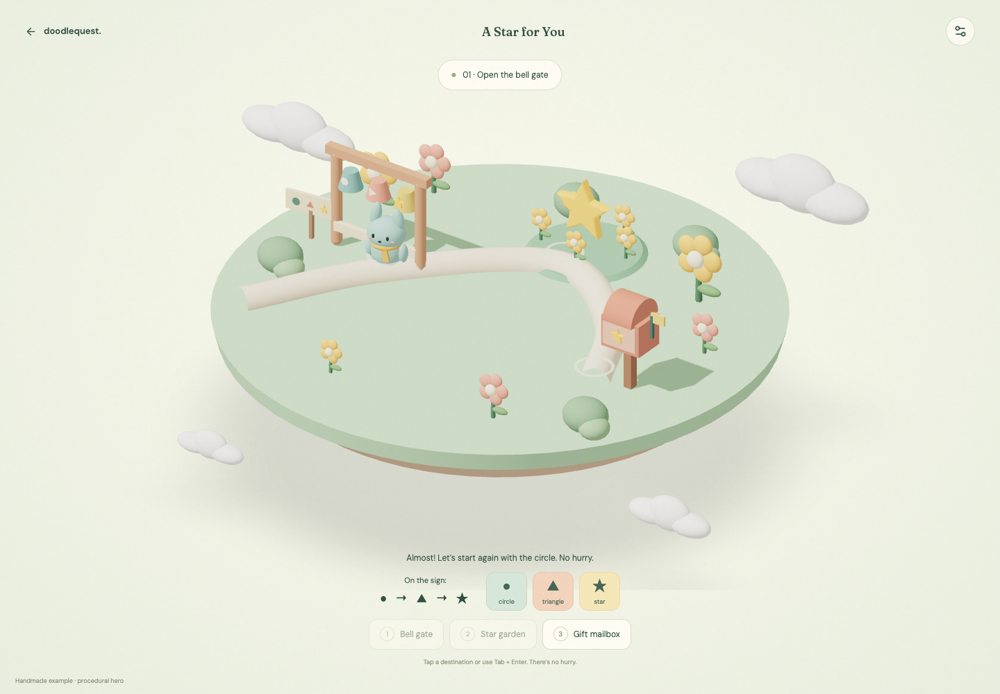

# DoodleQuest

**Your drawing deserves a world.** An adult-created, family-oriented browser prototype that turns a drawing into a 3D interpretation and the hero of a small playable gift.

Create a character, write a personal note, and share an unlisted adventure. The recipient rings three bells, collects a star, and delivers it to open their letter. The included Pip example works without credentials or paid generation.



## Quick start

Use **Node.js 24 and npm**, matching the repository's Docker image. Run these commands from the repository root:

```sh
npm ci
cp .env.example .env
npm run db:migrate
npm run db:seed
npm run dev
```

Copy the environment template only on first setup; keep an existing `.env`. Leave its credentials blank to use example mode. `db:seed` renders the repository's Pip drawing and initializes the schema; it makes no provider calls.

Open [http://localhost:3000](http://localhost:3000), the default `APP_ORIGIN`. `npm run dev` starts both Next.js and the durable Node worker; Ctrl+C stops both. Use the exact configured origin for creator actions: `localhost` and `127.0.0.1` are not interchangeable.

| Route                                       | What to try                                                                                                                                         |
| ------------------------------------------- | --------------------------------------------------------------------------------------------------------------------------------------------------- |
| [`/example`](http://localhost:3000/example) | Play the complete procedural example without credentials.                                                                                           |
| [`/create`](http://localhost:3000/create)   | Choose **Try it with our Pip drawing**, wait for the preview, and select **That’s my hero**. Add your words, preview, then wrap and publish a gift. |
| `/preview/<project-id>`                     | Play an owner-only draft preview from the workshop.                                                                                                 |
| `/gift/<token>`                             | Open an immutable published gift; recipients need no account.                                                                                       |

Drafts are stored on the server, with ownership tied to this browser's cookie. Keep that cookie: there is no account recovery. No child name, age, photo, school, or location is required.

## Choose a mode

| Mode                       | Configuration                                          | What it proves                                                                                                                                                                               |
| -------------------------- | ------------------------------------------------------ | -------------------------------------------------------------------------------------------------------------------------------------------------------------------------------------------- |
| **Example** (default)      | Leave `TRIPO_API_KEY` blank.                           | Complete quest, draft saving, approval, sharing, revocation and deletion with authored procedural Pip. **Pip is not Tripo-generated.** Custom uploads need live generation to become a hero. |
| **Live**                   | Server-side `TRIPO_API_KEY` and `CREATOR_ACCESS_CODE`. | Two successful Tripo image-to-model runs and local gameplay with their validated GLBs are recorded in the [verification record](docs/COMPLETION.md). Live rigging is still unverified.       |
| **Mock** (automated tests) | `E2E_MOCK_PROVIDER=1`, nonproduction only.             | Deterministic provider responses and a labeled octahedron GLB. Production rejects this flag; mock results are not live evidence.                                                             |

Live browser generation requires an unlocked creator session, explicit drawing-transfer consent and an available quota reservation. The default cap is **10 lifetime attempts for the installation and for each session**, including failed or uncertain attempts. See [configuration](docs/configuration.md) before enabling it and the [live smoke test](docs/operations.md#live-smoke-test) before claiming provider success.

## Create and play

The gift includes a permission-aware drawing reveal, an optional 60-character saying that travels with the star, a letter containing the creator's saved note, and a wrapping review before publication. Optional flower, cloud and butterfly interactions add small moments along the path. Gentle sounds are off by default and synthesized locally.

Pip has authored walking and celebration gestures. Generated heroes can optionally use Tripo rigging and animation: preview idle, walk and celebration in the workshop, then approve the result. Available movements depend on the character; unsupported shapes retain their gentle movement. See [hero motion](docs/experience.md#let-your-hero-move). Provider animation is tested with a skinned fixture, with live Tripo acceptance still unverified.

Mouse, touch and keyboard controls share the same quest. Pause, reduced motion, low rendering quality and a readable no-WebGL alternative are available. See the [creator and recipient guide](docs/experience.md) for the complete flow, controls and privacy behavior.

## Documentation

| Guide                                                                                                | Use it for                                                                            |
| ---------------------------------------------------------------------------------------------------- | ------------------------------------------------------------------------------------- |
| [Configuration](docs/configuration.md)                                                               | Environment variables, modes, credentials, quotas and local ports.                    |
| [Operations and troubleshooting](docs/operations.md)                                                 | Web/worker deployment, persistent storage, generation recovery and live verification. |
| [Render deployment](docs/RENDER.md)                                                                  | Service configuration, persistent disk, readiness and hosted acceptance checks.       |
| [Creator and recipient guide](docs/experience.md)                                                    | Making, playing, sharing, revoking and deleting gifts.                                |
| [Contributing](docs/CONTRIBUTING.md)                                                                 | Development commands, focused tests, recording evidence and Git conventions.          |
| [Architecture](docs/ARCHITECTURE.md)                                                                 | Source map, ownership, snapshots, worker reliability and rendering budgets.           |
| [Verification record](docs/COMPLETION.md)                                                            | Dated check results, measurements and unverified layers.                              |
| [Asset provenance](docs/ASSET_PROVENANCE.md)                                                         | Origins and permissions for drawings, geometry, music and generated assets.           |
| [Demo script](docs/DEMO_SCRIPT.md) · [Tripothon asset board](evidence/tripothon-s1/asset-board.html) | Recorded product evidence and suggested narration.                                    |
| [Drawing reveal](docs/REVEAL.md) · [Submission notes](docs/SUBMISSION.md)                            | Feature-specific evidence and the Tripothon S1 submission preparation.                |

## Delivery status

The **Tripothon S1 preparation was reconciled on October 3, 2026**. Two live Tripo image-to-model runs succeeded. The [87.33-second current walkthrough](evidence/tripothon-s1/walkthrough.mp4) shows the generated Mom & Dad model and a corrected gift from “Your little artist”; it reuses that model without another generation. It is a silent sequence of actual local browser captures, with generation waits visibly accelerated 8×. The [asset board](evidence/tripothon-s1/asset-board.html) and [submission notes](docs/SUBMISSION.md) accompany this local packet. No event entry has been submitted. The [GitHub repository](https://github.com/Xuefeng-Zhu/DoodleQuest) is now public, with anonymous access verified. Judges can access the source and reviewed media; a hosted playable demo is still pending.

[COMPLETION.md](docs/COMPLETION.md) records checks with their dates and scopes; older test results are not a claim of a fresh full-suite run. The [92.56-second baseline walkthrough](evidence/walkthrough.mp4) is retained as historical procedural-Pip evidence. Live Tripo rigging, Docker deployment, hosted HTTPS, backup/restore, Safari/Firefox and physical device/audio behavior remain unverified. Deployment requires **one persistent node with shared local SQLite and asset storage**; ephemeral serverless hosting is unsuitable.

Gift links are **unlisted, not fully private**. Anyone with a link can view its saved snapshot. Revocation blocks future requests but cannot retract downloaded copies. Project deletion removes local access and queues local file cleanup; provider-side deletion is not promised. Read the [privacy and sharing details](docs/experience.md#privacy-and-sharing) before using personal artwork.
