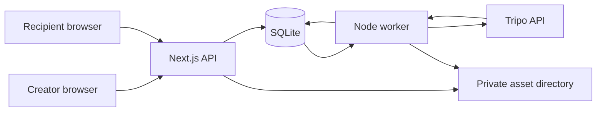

# Architecture

DoodleQuest runs as one Next.js application and one Node worker sharing SQLite and a private asset directory. The server owns drafts, generation and published snapshots; the browser runs an authored adventure around the approved character. Generated geometry never determines gameplay.

Use the [README](../README.md) for setup, [configuration](configuration.md) and [operations](operations.md) for running the services, [REVEAL.md](REVEAL.md) for the opening sequence, and [COMPLETION.md](COMPLETION.md) for recorded verification and its limits.

In this guide: [system map](#system-map) · [source map](#source-map) · [data and ownership](#data-and-ownership) · [generation](#generation-and-recovery) · [publication](#publication-and-receipt-handling) · [browser contracts](#browser-contracts) · [budgets](#asset-and-scene-budgets).

## System map



The creator uploads a drawing, requests generation, previews the result and explicitly approves it. The API records a durable job; only the worker uploads to Tripo, submits a task, polls it and validates the downloaded model. Publishing copies the approved draft into an immutable snapshot with an unlisted token. Recipients read that snapshot and its authorized assets without a creator session.

Both processes must use the same persistent `DATA_DIR`: `doodlequest.sqlite` stores records and `assets/` stores PNG/GLB files. This is a **single-node deployment with persistent local disk**. It is not designed for ephemeral serverless storage or multi-node coordination. There is no Redis or separate service framework.

## Source map

| Concern                | Entry points                                                                                                                                                                         | Responsibility                                                                  |
| ---------------------- | ------------------------------------------------------------------------------------------------------------------------------------------------------------------------------------ | ------------------------------------------------------------------------------- |
| Pages and API          | [`src/app/`](../src/app/), [`route.ts`](../src/app/api/[...path]/route.ts)                                                                                                           | Creator, preview, gift and example routes; request validation and authorization |
| Creator flow           | [`Creator.tsx`](../src/components/Creator.tsx), [`GiftWrapping.tsx`](../src/components/GiftWrapping.tsx)                                                                             | Draft editing, read-only polling, approval and publication                      |
| Persistence            | [`schema.ts`](../src/server/schema.ts), [`db.ts`](../src/server/db.ts), [`repository.ts`](../src/server/repository.ts)                                                               | Records, migrations, quota accounting, job claims and snapshots                 |
| Generation             | [`worker-entry.ts`](../src/server/worker-entry.ts), [`worker.ts`](../src/server/worker.ts), [`tripo.ts`](../src/server/tripo.ts)                                                     | Worker loop, recoverable job steps and provider adapter                         |
| Assets and access      | [`storage.ts`](../src/server/storage.ts), [`security.ts`](../src/server/security.ts), [`cleanup.ts`](../src/server/cleanup.ts)                                                       | Image/model validation, private files, owner tokens and deletion                |
| Adventure rules        | [`src/domain/`](../src/domain/), [`store.ts`](../src/components/game/store.ts)                                                                                                       | Pure state transitions, shared configuration and low-frequency UI state         |
| Rendering and controls | [`Game.tsx`](../src/components/Game.tsx), [`Scene.tsx`](../src/components/Scene.tsx), [`World.tsx`](../src/components/game/World.tsx), [`Hero.tsx`](../src/components/game/Hero.tsx) | Accessible DOM controls, scene loading, authored island and character placement |
| Sound                  | [`melody.ts`](../src/domain/melody.ts), [`MelodyPlayer.ts`](../src/components/game/MelodyPlayer.ts), [`useMelody.ts`](../src/components/game/useMelody.ts)                           | Fixed cues, bounded Web Audio scheduling and lifecycle cleanup                  |

`TripoProvider`, `AssetStorage` and `GenerationRepository` are small interfaces for their respective boundaries, not a multi-provider framework. [`env.ts`](../src/server/env.ts) selects example mode without a key, live mode with a key, or an explicitly enabled test mock. Mock mode is forbidden in production.

## Data and ownership

### Mutable drafts, immutable gifts

The main tables are defined in [`schema.ts`](../src/server/schema.ts):

| Table      | Contents and lifetime                                                            |
| ---------- | -------------------------------------------------------------------------------- |
| `sessions` | Creator token digest, expiry and access-code unlock state                        |
| `projects` | Mutable config, drawing revision, current model and approval                     |
| `assets`   | Project-owned file keys, sizes, kinds and validation metadata                    |
| `jobs`     | Input revision, provider task ID, status, lease and retry information            |
| `gifts`    | Independently random token, version, immutable JSON snapshot and revocation flag |

[`db.ts`](../src/server/db.ts) also creates `rate_limits`, lifetime `generation_usage`, `storage_gc` and migration bookkeeping. The idempotent migration runs when the database module loads and is also exposed through `npm run db:migrate`. SQLite uses WAL, a five-second busy timeout and immediate transactions for quota/job creation, lease claims, publication and deletion.

[`GiftConfigSchema`](../src/domain/config.ts) validates draft and snapshot reads. Defaults are applied in memory, so reading older JSON does not rewrite it. For example, the optional dedication defaults to an empty string; non-empty values are trimmed and limited to 60 characters. Publishing copies config and asset IDs into the next snapshot version. Later draft edits or replacement assets cannot overwrite an already shared version.

The uploaded file is decoded and re-encoded as a metadata-stripped PNG. The stored “original” is this normalized, uncropped image, not the original file bytes; a separate generation input applies the creator's rotation/crop choices. A snapshot references the drawing only when `showDrawing` is enabled.

### Access boundary

[`security.ts`](../src/server/security.ts) creates a 256-bit random `dq_owner` cookie that is HTTP-only, SameSite Strict and Secure in production. Only its SHA-256 digest is persisted, and the session expires after 90 days. Draft operations require that session and matching project ownership; non-GET API requests also require the configured exact origin. The browser generation route additionally requires an unlocked session and explicit consent. The trusted [operator sample CLI](configuration.md#operator-sample-command) creates its own unlocked session.

Gift tokens are independently random bearer links: anyone holding an active link can read its snapshot. Asset requests using a gift token must match both the gift's project and an exact asset ID in its snapshot. Other private asset reads require project ownership. Gift payloads and private assets use `no-store` responses; file paths are server-generated.

Deleting a project atomically removes its database access and queues its files for deletion. Active worker leases temporarily block deletion. The worker retries queued unlinks, while lifetime generation counts remain to prevent delete-and-regenerate quota resets. Local deletion does not establish provider-side deletion. Creator sessions do not provide account recovery.

## Generation and recovery

```text
pending → uploading → submitting → queued / generating → downloading → ready
```

[`requestGeneration`](../src/server/repository.ts) scopes the caller's idempotency key to the project and reuses an active attempt for the same drawing revision. Creating a new attempt and consuming quota happen in one immediate transaction. Both the per-owner and global lifetime counts are checked against `GENERATION_QUOTA`.

[`processOne`](../src/server/worker.ts) claims due jobs with a 120-second lease and a random fencing token. Subsequent job updates must match that token. Provider requests time out after 30 seconds and model downloads after 45 seconds, each shorter than the lease. The worker stores the actual provider status separately from the application's normalized status.

| State or failure                                    | Recovery contract                                                                                 |
| --------------------------------------------------- | ------------------------------------------------------------------------------------------------- |
| Saved provider task ID                              | Retrieve that task; never submit it again                                                         |
| `uploading` / `polling`                             | Retry the safe upload or read step with exponential backoff                                       |
| `asset_retry`                                       | Provider succeeded but local download or validation failed; retry delivery without new generation |
| `submitting` without a saved task ID after recovery | Stop as `uncertain`; the provider may have consumed credits                                       |
| `failed` / `uncertain`                              | Require an explicit new attempt; no automatic paid retry                                          |

The worker persists `submitting` before the outbound create request. If the response or task-ID persistence is interrupted, it does not assume that submission failed. No provider idempotency or reconciliation endpoint is assumed. Safe retry backoff is capped at five minutes; a larger provider rate-limit delay can extend the wait.

Downloaded models must pass local validation before becoming `ready`. A model is attached to the draft only if its drawing revision still matches, and approval is cleared. The creator UI enables approval only after the preview loads; preview failures never request another generation.

### Optional motion pipeline

`POST /api/projects/:id/animate` queues an owner-authorized animation attempt for an existing generated model. The separate `motion_jobs` table records the source model/revision, compatibility task, rig task, retarget task, stage, lease, and result. The worker advances `rig_check → rig → retarget`, saving each task ID before continuing. One application quota reservation covers that bounded pipeline; provider credits may be charged separately for its stages. Explicit retries reserve another attempt but retain completed earlier stages.

Known tasks are polled again after restart. An unconfirmed submission stops as `uncertain`; completed output delivery retries without repeating a paid stage. Unsupported rig types and failed attempts preserve the original model and approval. The final result must pass the GLB and motion checks; replacement is fenced by both the job lease and the exact current model/revision. The replacement clears approval. Previously published snapshots continue to reference the earlier asset. Drawing replacement, new model generation, and deletion cannot race an active motion attempt.

## Publication and receipt handling

[`Creator.tsx`](../src/components/Creator.tsx) saves the latest config before publishing; a failed save cannot publish. The combined save/publish request sequence has a 20-second client deadline. [`GiftWrapping.tsx`](../src/components/GiftWrapping.tsx) uses a native modal with an in-flight guard and shows the sealed receipt only after confirmation. Its animations never gate copying the link.

An unconfirmed publication switches to an explicit read-only check: reload owner shares, find a new active version and read its immutable config. This check has a 15-second deadline and does not POST or automatically publish again. The publish response includes the gift ID, token and version so a confirmed receipt needs no follow-up request. This protects the mounted flow; publication is not server-idempotent across tabs or deliberate new submissions.

The modal uses heading focus, native background inertness, close-before-unmount focus return, scrollable notes and reduced-motion CSS. Clipboard success appears only after `writeText` resolves; failure selects the read-only link for manual copying. Closing the modal does not revoke a gift, and publishing does not send a message to the recipient.

## Browser contracts

### Progression and rendering

[`quest.ts`](../src/domain/quest.ts) owns prerequisites, location checks, duplicate guards and the circle → triangle → star sequence. The authored route is bell gate → star garden → mailbox. Completing the quest keeps the ending stable until replay. Generated geometry is visual content, never collision geometry or a source of progression rules.

[`Game.tsx`](../src/components/Game.tsx) owns DOM controls, objectives, settings and the ending. Those controls remain usable when WebGL or model loading fails. Zustand stores progression and settings; movement uses a mutable animation ref and commits one transition on arrival instead of updating React on every frame.

[`Hero.tsx`](../src/components/game/Hero.tsx) normalizes the model's bounding box and applies the creator's forward rotation outside the animated hierarchy. [`HeroAnimation.ts`](../src/components/game/HeroAnimation.ts) clones skeletons per instance and crossfades recognized embedded GLB idle/walk/celebration clips. Waypoint movement remains outside the animation root. Missing motions use the selected procedural movement; physics and generated collision meshes remain unnecessary. Meshopt is bundled; unsupported required GLB extensions are rejected during validation.

[`hero-motion.ts`](../src/domain/hero-motion.ts) recognizes accepted gate, star and delivery transitions. Reactions play once, movement interrupts them, and replay clears them. A ref-based clock freezes for pause and hidden tabs; reduced motion settles a static pose and drops pending reactions. Creator previews can request idle/walk/celebrate independently. Pip's limb and head motion is authored, with no claim of Tripo rigging. Canvas diagnostics expose a bounded read-only sample of motion state and bone pose for browser checks.

### Presentation states

**Opening reveal.** [`reveal.ts`](../src/domain/reveal.ts) and [`useGiftReveal.ts`](../src/components/game/useGiftReveal.ts) keep presentation separate from quest progress. One canvas and loaded hero carry the comparison into the island. Drawing-disabled gifts never mount the drawing; reduced motion skips camera travel. See [REVEAL.md](REVEAL.md).

**Island celebration.** [`celebration.ts`](../src/domain/celebration.ts) and [`IslandCelebration.tsx`](../src/components/game/IslandCelebration.tsx) derive ribbon lights, garden blooms and ending glow from quest state. Ref-driven transitions freeze on pause/hidden tabs and settle immediately with reduced motion. Replay and wrong-bell resets clear obsolete effects. They add no lights or postprocessing.

**Optional wonders.** [`wonders.ts`](../src/domain/wonders.ts), [`TinyWonders.tsx`](../src/components/game/TinyWonders.tsx) and [`WonderControls.tsx`](../src/components/WonderControls.tsx) share guarded flower/cloud/butterfly actions across scene and DOM controls. Active input does not stack or extend effects. The DOM-owned [`useWonderClock`](../src/components/game/useWonderClock.ts) also works without WebGL, pauses on hidden tabs/settings and writes only at activation/settling. Completion, replay and unmount clear effects; reduced motion uses static responses.

**Letter.** [`letter.ts`](../src/domain/letter.ts) and [`GiftLetter.tsx`](../src/components/GiftLetter.tsx) mount after delivery and move sealed → opening → reading. Opening/folding changes no quest state or snapshot. The full plain-text note appears in a keyboard-scrollable reading sheet; the optional drawing mounts only after opening keepsake details. This is a presentation reveal, not encryption: the authorized payload already contains the note.

**Dedication.** [`DedicationTag.tsx`](../src/components/DedicationTag.tsx) presents the same plain-text saying at opening, while carrying the star, and in the letter. The moving Drei `Html` tag is hidden from the accessibility tree; the game status announces it. The no-WebGL path has a visible DOM tag. Empty values render nothing.

Celebration, wonders, reveal, letter and audio introduce no persisted gameplay state or extra provider calls. The butterfly and character share the waypoint-position sampler so their movement stays aligned.

### Audio lifecycle

[`melody.ts`](../src/domain/melody.ts) defines a fixed three-note bell motif, a higher collection echo and a resolving letter phrase. Cues follow accepted quest actions; a wrong bell at the bell station still rings, while ignored input is silent. Sound is off by default.

[`MelodyPlayer`](../src/components/game/MelodyPlayer.ts) lazily creates one Web Audio context and resumes it from a user gesture. A cue uses at most 14 oscillators, and a new cue replaces the previous one. A revision fence rejects stale asynchronous resume results, a 1.5-second deadline reports unavailable audio, and finished nodes disconnect. UI updates occur at cue boundaries.

Mute, pause, hidden tabs, page exit, folding and replay cancel sounding and scheduled notes without automatic resumption. Unmount closes the context. The first letter opening can play once per adventure; replaying its melody is an explicit action. There are no generated tracks, external samples or paid audio calls. Tests of scheduling and the browser audio graph do not establish physical speaker audibility.

## Asset and scene budgets

[`storage.ts`](../src/server/storage.ts) enforces the following input/model limits. Binary byte limits are expressed here in MiB (`1024²` bytes); UI messages label them MB.

| Resource            | Enforced limit                                                                                               |
| ------------------- | ------------------------------------------------------------------------------------------------------------ |
| Upload              | Still JPEG/PNG, 10 MiB, 64–8000 pixels per side, at most 24,000,000 input pixels                             |
| Normalized image    | Fits within 1536 × 1536 without enlargement, or a 1024 × 1024 square crop                                    |
| Model               | Complete GLB 2.0, 25 MiB, 100,000 triangles, triangle meshes only                                            |
| Model structure     | 64 MiB declared decoded buffers, 64 primitives, 512 nodes, 128 meshes, 64 materials, 16 textures             |
| Animation structure | 8 skins, 256 joints per skin, 16 clips, 4,096 total channels, 500,000 total keyframes; ten-minute clip limit |
| Textures            | Embedded resources only; at most 4096 pixels per side and 16,777,216 combined pixels                         |
| Required extensions | Meshopt compression, texture transform and unlit materials only                                              |

Tripo is asked for 20,000 faces, but the returned output is validated independently. Downloads require HTTPS and an allowlisted host, reject redirects and private DNS addresses, and enforce the file-size limit while streaming.

The scene targets at most 150,000 triangles and 250 draw calls; these are measured budgets, not server-enforced scene limits or a frame-rate guarantee. [`World.tsx`](../src/components/game/World.tsx) records 120-frame samples on the canvas. Rendering caps DPR at 1.5 (1 in low mode), uses one directional shadow map and a cached contact shadow, and has no postprocessing. Low mode disables shadows and antialiasing. Consult [COMPLETION.md](COMPLETION.md) for measurements and the environments in which they were taken.
